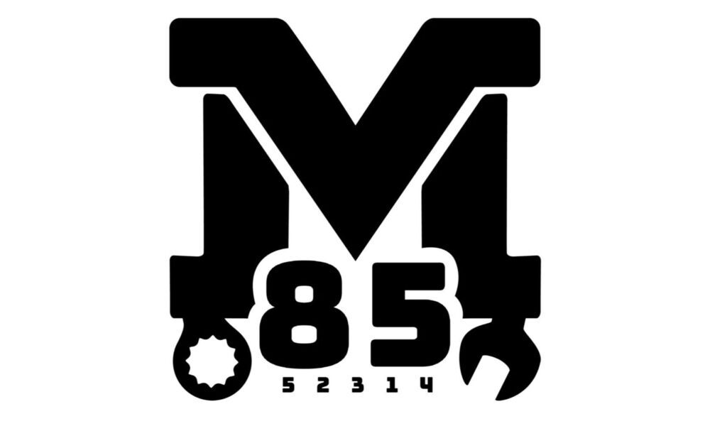

85B is a highschool Vex Robotics team based in Mount Vernon Iowa named Enganirs. 85B Enganirs was founded by 3 students in the class of 2027. Today 85B is the varsity and competitive team of Mount Vernon Robotics and strives to help other teams with developing their program.
